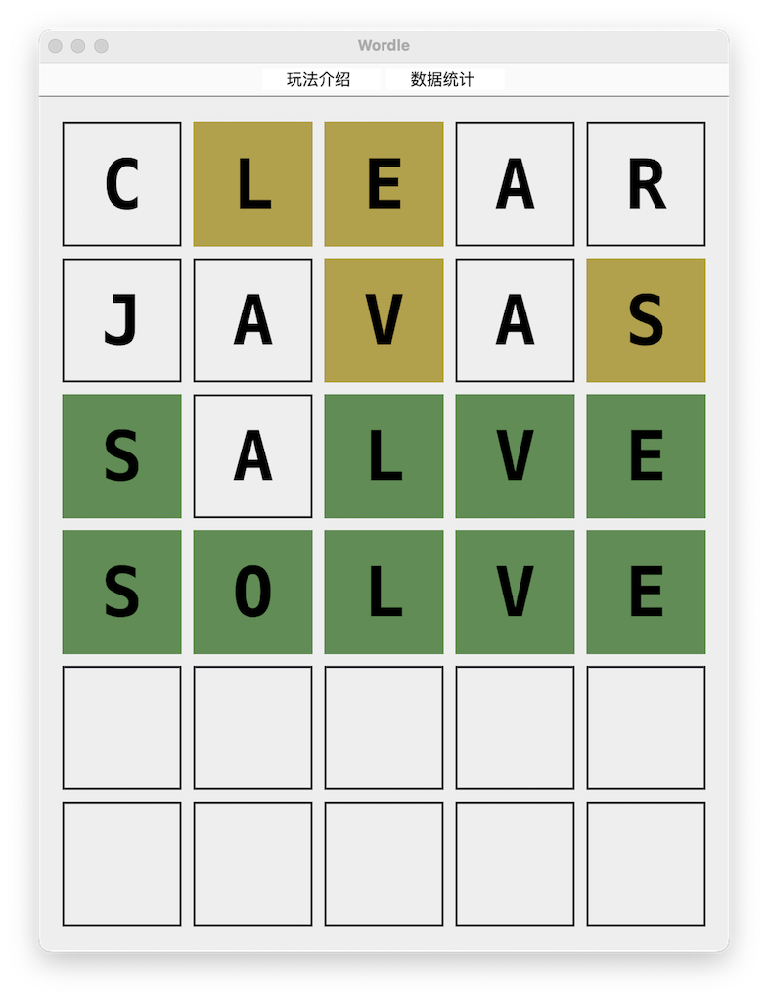

# Wordle-Java-Swing
* [Background](#bg)
* [Introduction](#intro)
* [Usage](#usage)
* [References](#ref)
## Background
大一面向对象程序设计的期末课程设计要求是用Java写一个程序，最好能用上数据库，而网上现存的案例大多是某某管理系统或是贪吃蛇等小游戏，写的人太多，毫无新意。因为最近新出的Wordle游戏很火也很好玩，所以写了一个简单版本。
## Introduction
使用Java语言编写，图形界面由Java Swing构建。

在六次机会内猜中所给的由五个字母组成的单词，包含数据统计功能。

使用MySQL数据库存储单词，通过SQL查询随机返回单词。数据库连接信息在文件DBConnection.java中。

该项目包含[TXT](https://github.com/Charles-Stark/Wordle-Java-Swing/blob/master/src/Resources/word_list.txt)和[Json](https://github.com/Charles-Stark/Wordle-Java-Swing/blob/master/src/Resources/words.json)文件的Wordle词库。

因为课程设计要求使用很多知识点，且时间紧促，代码有些繁杂冗余，仅供参考。仍有很大改进空间：
* 扩充词库，不局限于每个单词5个字母
* 增加词频统计，避免经常出现生僻词，提升可玩性
* 每轮结束后显示单词释义和用法
* ......
## Usage
自行下载MySql数据库并创建数据表；

下载代码后修改DBConnection.java文件中的数据库连接信息，通过运行/src/Resources/WordsToDB.java将词库从TXT文件转移至数据库中；

运行项目即可。
## References
* [Wordle - The New York Times](https://www.nytimes.com/games/wordle/index.html)
* [30分钟玩转Swing界面设计](http://c.biancheng.net/swing/)
